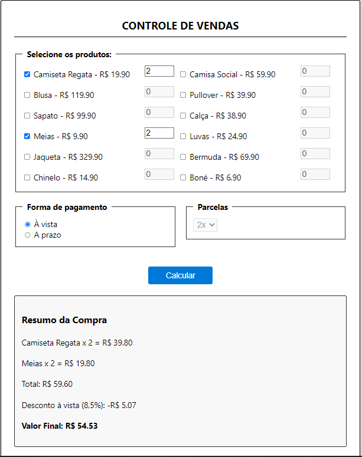

# 💳 Simulador de Pagamento - SPA

Este projeto é uma aplicação web do tipo SPA (Single Page Application) desenvolvida em HTML, CSS e JavaScript. A interface permite que o usuário selecione produtos, defina quantidades, escolha a forma de pagamento e visualize em tempo real os valores de parcelas, taxas e descontos.

## 🚀 Funcionalidades

- Seleção de produtos com quantidade ajustável
- Cálculo de pagamento em tempo real
- Suporte a pagamento à vista (com 8.5% de desconto)
- Suporte a parcelamento (com taxas aplicadas)
- Validação de valor mínimo por parcela
- Interface responsiva e organizada

## 📋 Regras de Negócio

- Parcelas permitidas: 2, 3, 4 ou 5
- Valor mínimo por parcela: R$ 10,00
- Taxa de parcelamento: 6% sobre o valor total + R$ 6,90 por parcela
- Desconto à vista: 8,5% no valor total

## 🛠 Tecnologias

- HTML5
- CSS3
- JavaScript 

